# Eet-share
Eet-share is een systeem gemaakt om makkelijker boodschappenlijstjes aan te maken.
In eet-share zijn verschillende functies waar users gebruik van kunnen maken.

- Producten in huis: Hier kunnen alle producten die je in huis hebt opgeslagen worden, hier hoort natuurlijk ook de kwantiteit van het product bij.
- Boodschappenlijstje: Hier kunnen users hun boodschappenlijstje aan maken, deze wordt gedeeld met het huishouden waar de user in zit.
- Favorietenlijsjte: Iedere user kan in heeft een favorietenlijstje.
- Huishouden: Hier kan de user zien in welk huishouden hij/zij zit.
- Uitnodigen nieuw familielid: Het hoofd van het huishouden kan nieuwe familieleden uitnodigen.
- Accepteren/weigeren uitnodiging: De uitgenodigde user kan de uitnodigingen van hoofden accepteren of weigeren.
- Kookboek: Hier kunnen users binnen het huishouden door het kookboek kijken.
- Toevoegen recepten: Hier kunnen users recepten aan het kookboek toevoegen door middel van een template.

## Stapsgewijs door het systeem heen lopen
### 1. Account aanmaken
[Account aanmaken](https://tests-1718633149689.azurewebsites.net/)
Maak hier uw account aan met een unieke username en een wachtwoord.
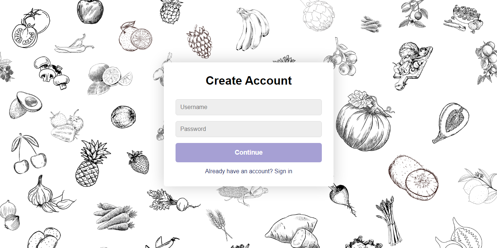

### 2. Huishouden aanmaken/uitnodiging accepteren
Wanneer u een nieuw account heeft aangemaakt kunt u maar gebruik maken van 1 link, dit is de link "Huishouden". 
Dit is omdat je in een huishouden moet zitten voordat je gebruik kan maken van de andere functies binnen dit systeem.
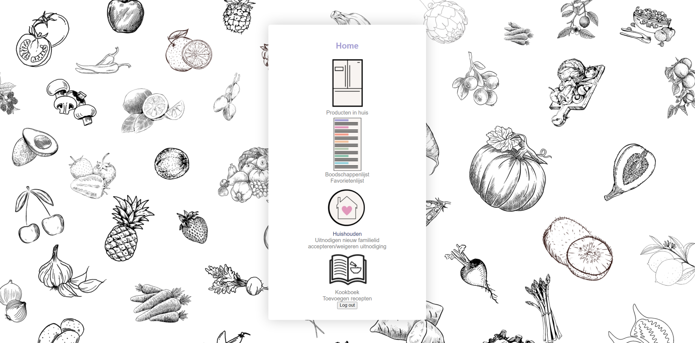

Dan klikken we op het linkje van "Huishouden" en dan komen we op de pagina van het huishouden.
Zoals u kunt zien is er een button met "Huishouden aanmaken" hiermee maakt u natuurlijk een huishouden aan, 
maar wat u ook kunt doen is met uw muis over het menu aan de linker kant heengaan. Zoals u ziet wordt deze vergroot en ziet u meerdere links.
Hier kunt u als u uitgenodigd bent door een hoofd van een huishouden ook de uitnodiging accepteren.
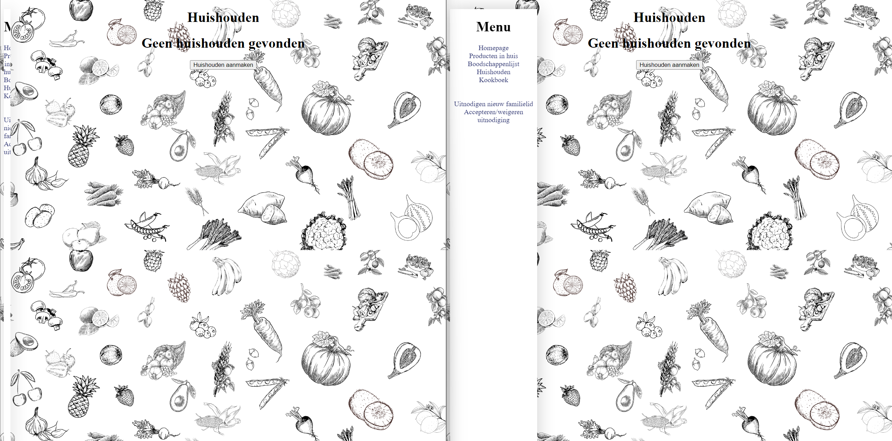

De linker gebruiker maakt een huishouden aan, dit wordt zometeen dan ook het hoofd van het huishouden. 
De gebruiker op het rechter scherm accepteert de uitnodiging die een hoofd van een huishouden heeft doorgestuurd, deze gebruiker wordt dan een lid van het huishouden waar hij/zij voor uitgenodigd was. 
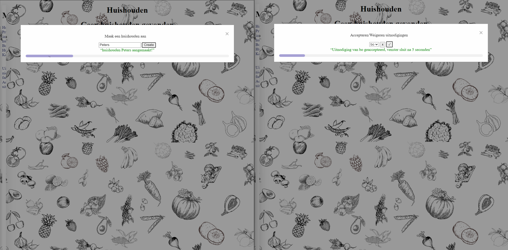

Zoals u hier kunt zien is er nu een huishouden genaamd Peters met een hoofd en één lid. Een huishouden heeft ook altijd maar 1 hoofd, maar er kunnen wel meerdere leden in een huishouden zijn.
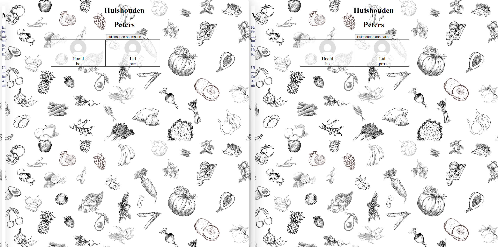

### 3. Producten In Huis
Zoals u kunt zien zijn alle links nu blauw bij zowel het hoofd van het huishouden en bij het lid van het huishouden.
We zullen nu naar de link "Producten in huis" gaan. (We bevinden ons nu op de homepage maar je kunt ook hier naartoe vanuit het menu aan de linker kant)

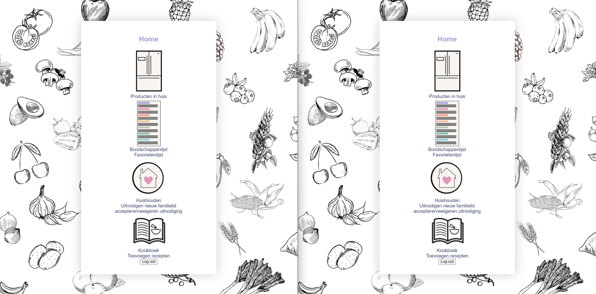

Op de pagina ziet u verschillende "locatie" namen, waar u in kunt zetten waar u uw producten bewaart.
deze "locaties" kunnen open geklapt worden door erop te klikken. 
Hier ziet u een button met add a product, klik hierop en dan krijgt u een nieuwe rij te zien waar je een number input en een dropdown menu hebt waar u het product kunt selecteren. 
Als hij niet automatisch de nieuwe rij laat zien, sluit en open de "locatie" even.
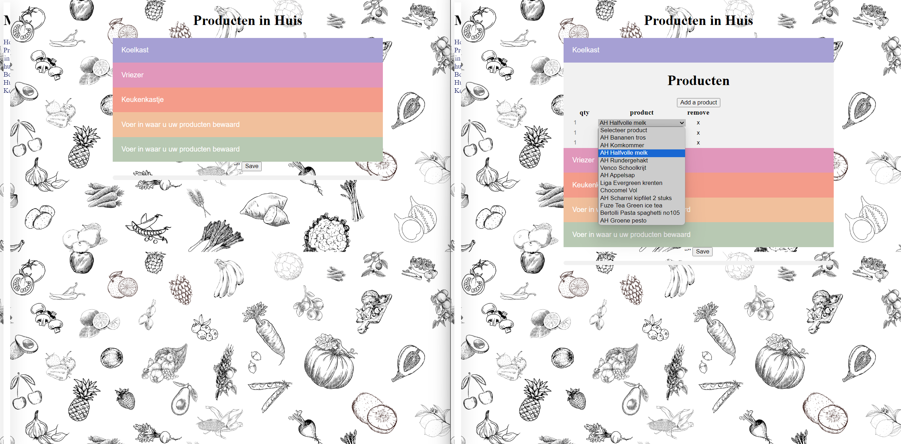

Wanneer u alle producten heeft geselecteerd en de kwantiteit erbij heeft neergezet kunt u op de knop "save" onderaan klikken.
Als u dan de pagina herlaadt (Het systeem doet dit ook automatisch na 5 seconden, zie de loading bar onderin) krijgt u de producten te zien die u heeft opgeslagen.
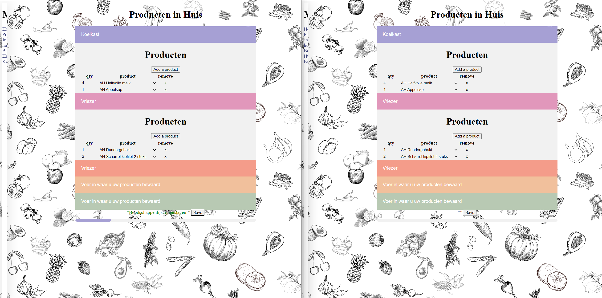

### 4. Boodschappenlijstje

Laten we door gaan naar het boodschappenlijstje. We zullen deze keer het menu gebruiken om er naartoe te gaan.
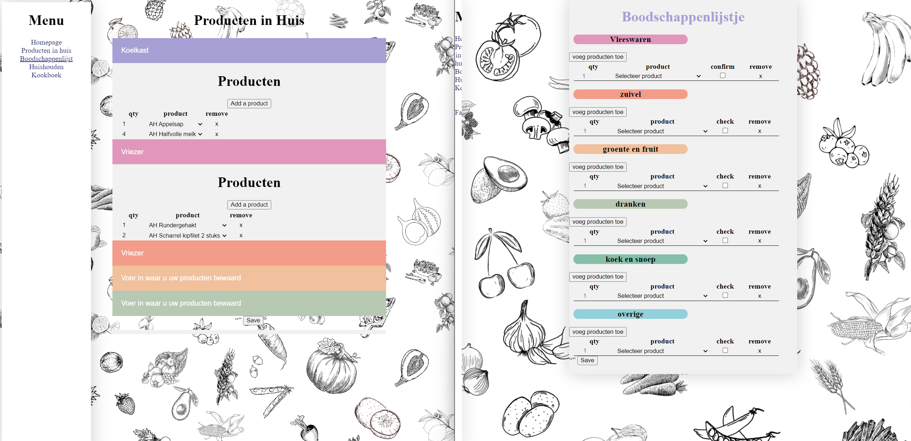

Zoals u kunt zien werkt het boodschappenlijstje bijna hetzelfde maar er zijn nogsteeds vrij grote verschillen.
In het boodschappenlijstje zijn er ook buttons met "voeg producten toe", maar bij het boodschappenlijstje wordt er per category gekeken.
Onderaan het boodschappenlijstje staat ook weer de "save" button.
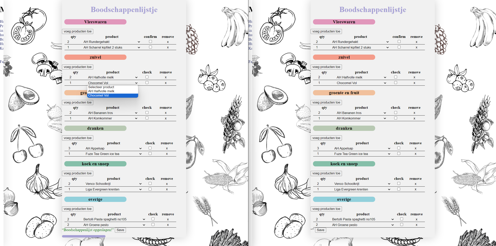

### 5. Favorietenlijsjte

Dan hebben we nog het favorietenlijstje, deze is in principe bijna hetzelfde qua functionaliteit als het boodschappenlijsjte.
Het enige verschil is dat er geen kwantiteit bij de producten worden neergezet.
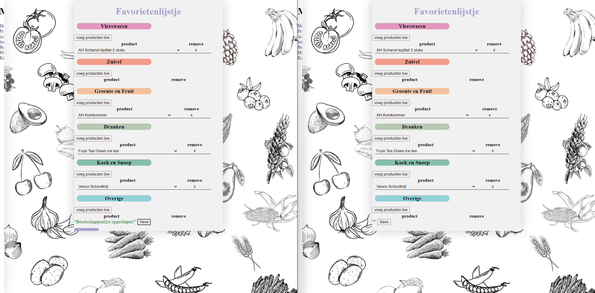

### 6. Toevoegen recepten

Als je de naar de pagina van recepten toevoegen gaat krijg je eerst een template te zien. 
Hier kan je de naam van het gerecht, de servings, kooktijd en voorbereidingstijd neerzetten (de voorbereidingstijd en kooktijd worden in minuten hier gevraagd). 
In het grote groene vlak kan je de instructies neerzetten. 
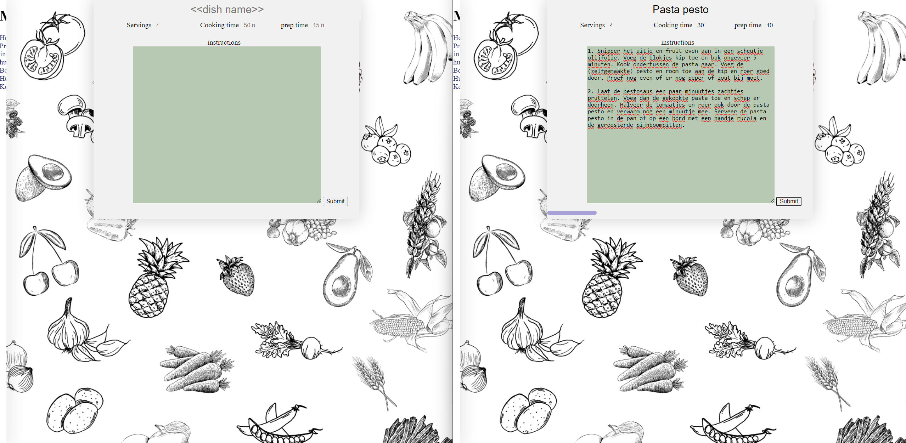

### 7. Kookboek

Het allerlaatste wat je dan nog kan doen binnen deze website is naar het kookboek gaan.
Hier kunt u naar recepten zoeken die door u of door huisgenoten aangemaakt zijn, als u dan op de knop "search" klikt komt het recept tevoorschijn.
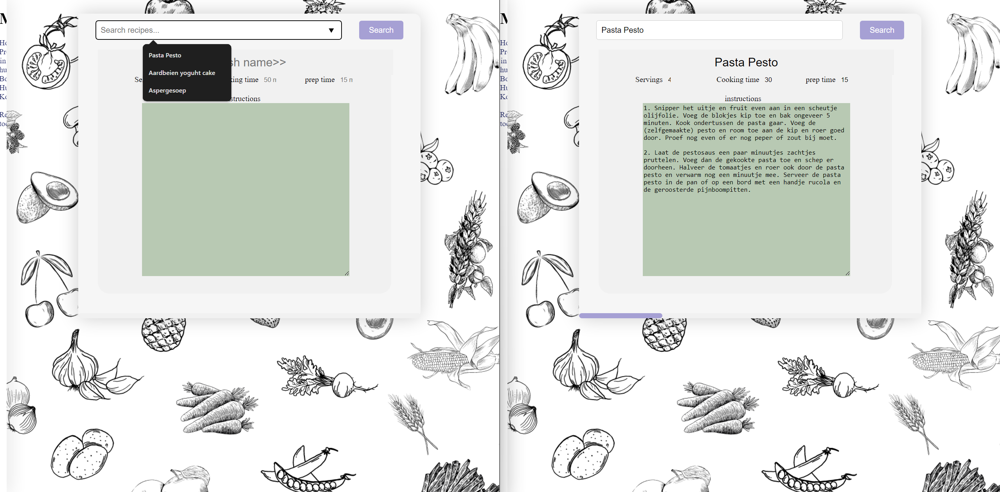

Dit was dan alles wat er binnen het systeem valt. 

